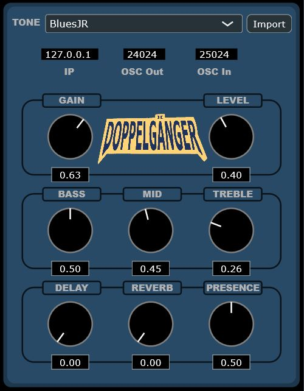
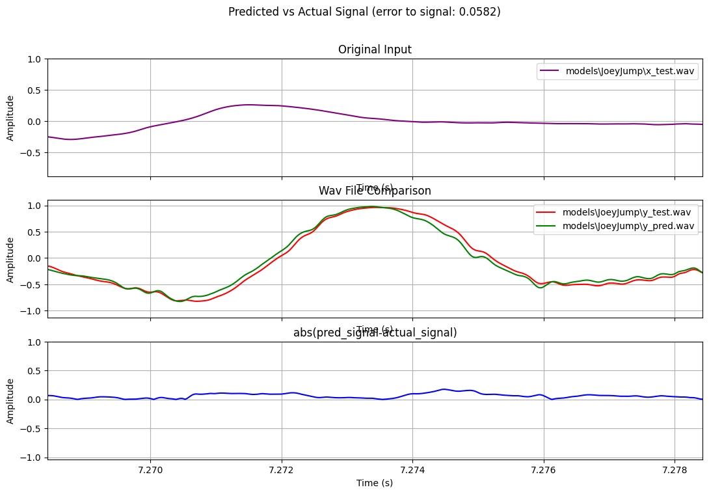

# The Doppelganger

The Doppelganger is a machine learning powered guitar pedal that uses nerual network models to emulate existing distortion pedals and amplifiers real-time. All together, the Doppelganger is a VST 
plugin hosted on a raspberry pi and controlled from a remote computer. Neural network models can be loaded into the plugin and further customized with a variety of parameters (Gain, 
Master level, 3 band EQ, Reverb, Delay, and Presence). Model selection and parameter adjustment can be done over internet connection with a remote instance of the 
plugin.  
  
## Doppelganger Plugin UI  
  
  
  
## Elk and Sushi  
The Raspberry Pi 4 used for this project is running on [Elk Audio OS](https://www.elk.audio/), which is
a low-latency Linux distribution optimized for digital signal processing performance. The plugin is stored in
the 'Plugins' directory of Elk and excecuted with a json config file that runs the plugin in Sushi, Elk's built-in DAW.  
  
## HiFiBerry  
In order to connect directly to a guitar and amplifier, the Raspberry Pi must be fitted with a DAC/ADC to convert
audio signal from analog to digital for processing, and back to analog for output.
The Doppelganger is equipped with the DAC + ADC hat from [HiFiBerry](https://www.hifiberry.com/shop/boards/dealing-with-blocked-p5-holes-8/).  
  
## PedalNetRT  
Original neural network models are trained using [PedalNetRT](https://github.com/GuitarML/PedalNetRT),
a training setup that utilizes pytorch-lightning. The training program takes two wav files as arguments. The first (in.wav) contains clean signal guitar playing, and the second (out.wav) contains the signal after the desired effect(s) have been applied. The goal of the training process is to minimize the error between the expected signal (out.wav) and the observed signal (the model output).  
  
#### Example signal comparison graph from JoeyJump model  

  
Plugin source code is cloned, updated and in some cases modified from [GuitarML](https://github.com/GuitarML)'s 
open-source NeuralPi plugin.